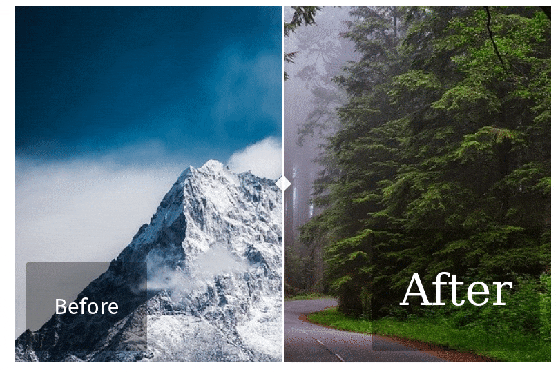

# ricv

ricv lets you create interactive image comparators from R. It works in [Rmarkdown](https://rmarkdown.rstudio.com/) documents and [Shiny](https://shiny.rstudio.com/) application. Under the hood, it is just a tiny wrapper around the [image-compare-viewer](https://github.com/kylewetton/image-compare-viewer/) Javascript Library.

## Installation

```{r eval=FALSE}
devtools::install("xvrdm/ricv")
```

## Usage

```{r eval=FALSE}
library(ricv)
ricv(img1 = "mountains.jpg", img2 = "trees.jpg",
     options = list(addCircle = T, hoverStart = T))
```


<br />

## CSS

The `ricv()` function also has an argument named `css`, which expect a list in the format:

```
list(both = "some-css-for-both-label",
     before = "some-css-for-both-label"
     after = "some-css-for-the-after-label")
```

This can be used to modify the look of the labels. However, remember that the actual display of the labels is driven by one of the `options`.

```{r eval=FALSE}
ricv(
  img1 = "mountains.jpg", img2 = "trees.jpg",
  options = list(addCircle = T, hoverStart = T, showLabels = T),
  css = list(both = "padding: 40px;", 
             before = "font-size: 2rem;", 
             after = "font-size: 4rem; font-family: serif;")
)
```



<br />

## Options

If you don´t want to create by hand the `options` list accepted by `ricv()`, you can use the helper function `ricv_opts()`, which gives you autocomplete and a convenient reminder of the possible attributes. For reference, see below all the possible options. The [image-compare-viewer](https://github.com/kylewetton/image-compare-viewer/) has examples for a few of them.

```{r}
ricv::ricv_opts()
```

    ## $controlColor
    ## [1] "#FFFFFF"
    ## 
    ## $controlShadow
    ## [1] TRUE
    ## 
    ## $addCircle
    ## [1] TRUE
    ## 
    ## $addCircleBlur
    ## [1] TRUE
    ## 
    ## $showLabels
    ## [1] TRUE
    ## 
    ## $smoothing
    ## [1] TRUE
    ## 
    ## $smoothingAmount
    ## [1] 200
    ## 
    ## $hoverStart
    ## [1] FALSE
    ## 
    ## $verticalMode
    ## [1] FALSE
    ## 
    ## $startingPoint
    ## [1] 50
    ## 
    ## $fluidMode
    ## [1] FALSE
    ## 
    ## $labelOptions
    ## $labelOptions$before
    ## [1] "Before"
    ## 
    ## $labelOptions$after
    ## [1] "After"
    ## 
    ## $labelOptions$onHover
    ## [1] TRUE
